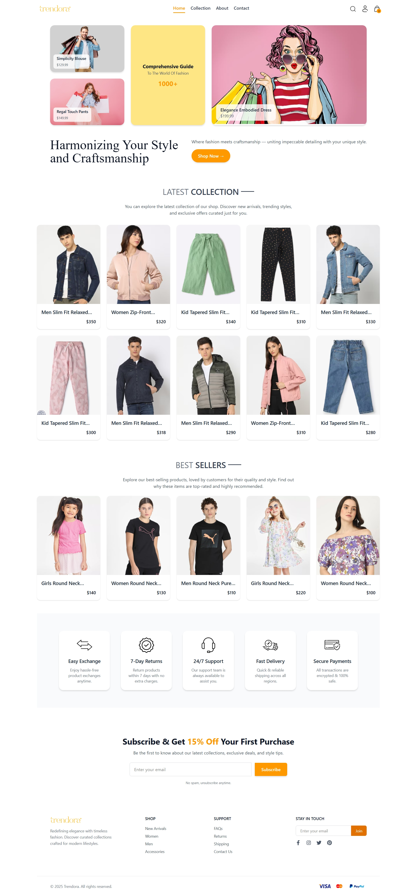
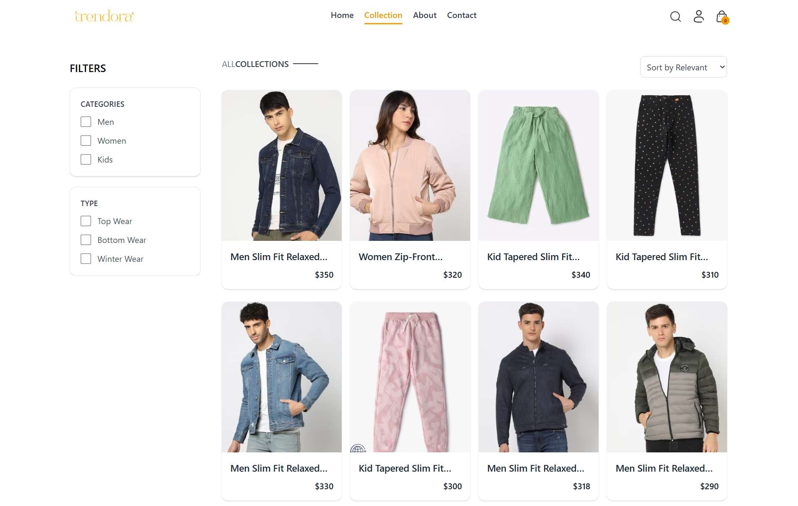
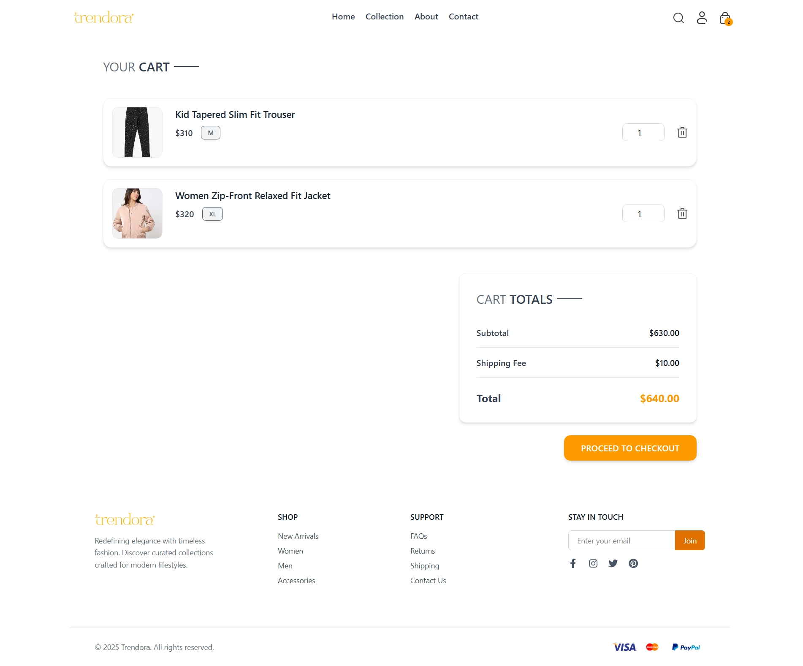
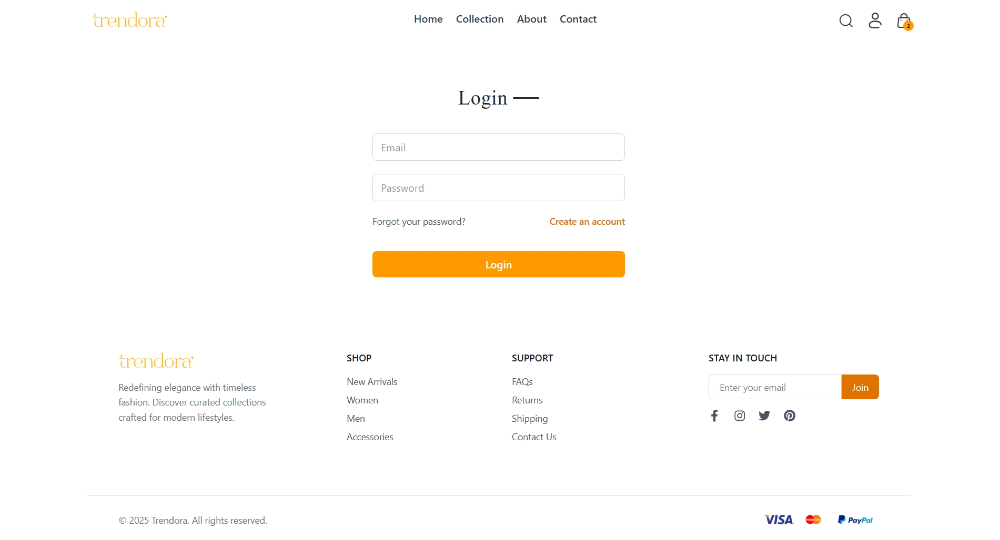

# 🛍️ Trendora – Online Shopping Mall

  

**Trendora** is a modern, full-featured online shopping mall built using the **MERN stack (MongoDB, Express.js, React.js, Node.js)**.  
It provides users with a seamless eCommerce experience — from browsing trending products to secure checkout.

---

## 🌐 Live Demo  
> 🔗 [https://trendora-frontend-psi.vercel.app]
---

## 🚀 Features

### 👥 User Features
- 🔍 Browse and search for trending products  
- 🛒 Add, remove, and manage items in cart  
- 📏 Select product sizes and quantities  
- 🔐 Secure login & signup (JWT Auth)  
- 💳 Smooth checkout flow  
- 📱 Fully responsive UI for mobile, tablet, and desktop  

---

## 🧩 Tech Stack

| Category | Technologies |
|-----------|---------------|
| **Frontend** | React.js, React Router, Context API, Axios, Tailwind CSS, React Toastify |
| **Backend** | Node.js, Express.js |
| **Database** | MongoDB with Mongoose |
| **Authentication** | JWT (JSON Web Token) |
| **Other Tools** | dotenv, nodemon, bcrypt, cloud storage for images |

---

## 📸 UI Screenshots

| Home Page | Product Page |
|------------|---------------|
|  |  |

| Cart Page | Login / Signup |
|------------|----------------|
|  |  |

---

